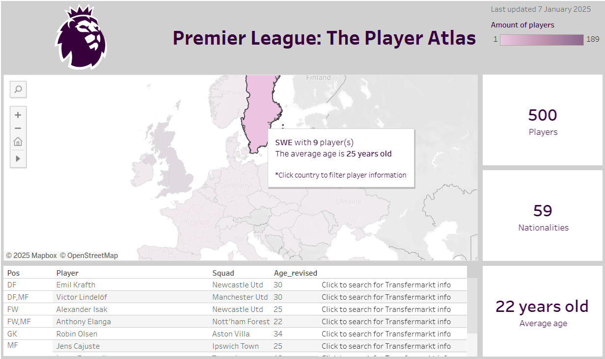

# Premier League: The Player Atlas
## Tableau
### Click **[here](https://public.tableau.com/shared/MG2DMYRCM?:display_count=n&:origin=viz_share_link)** for the Tableau dashboard

The dashboard gives an overview of
- Active countries in the Premier League
- Amount of players per country
- Average age of the respective players
In addition, player specific information is included.

## 🌟 Features
- **Data visualization**, like the interactive map
- **User interaction**, like several dashboard actions
- **Lay-out and design**, like color schemes and branding

